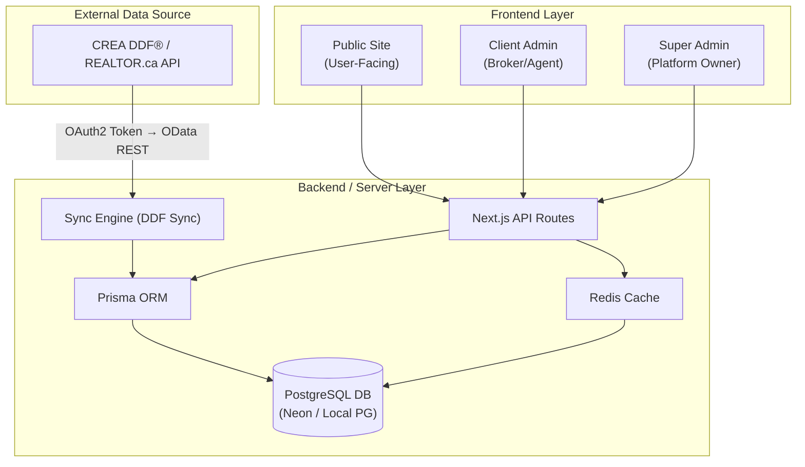
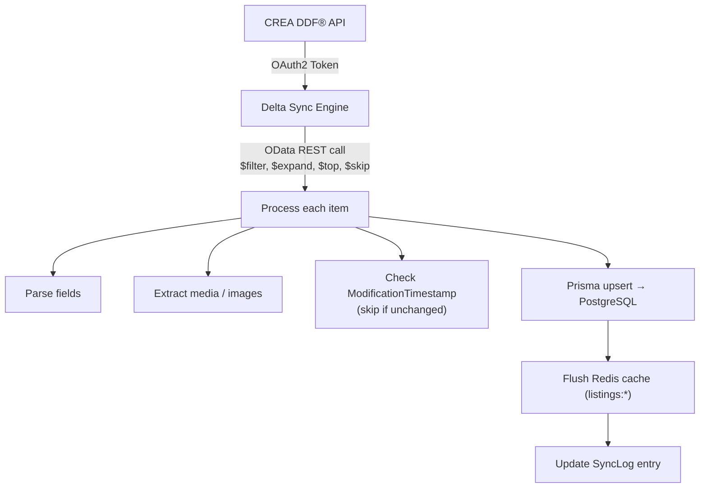
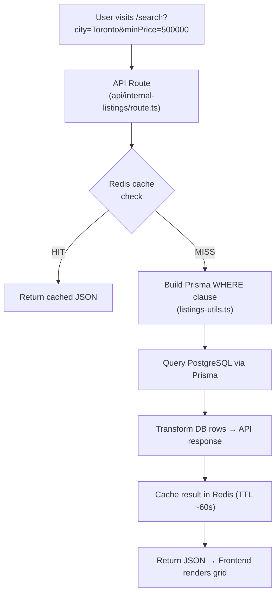
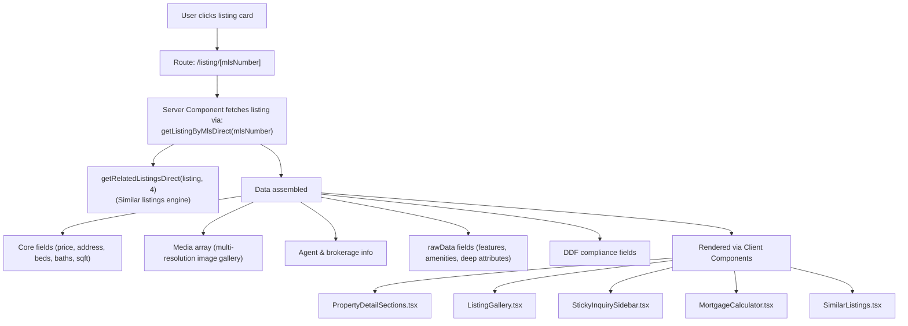

# 🏠 Real Estate Platform — System Overview

> **Purpose:** Help a new backend developer understand the high-level architecture and navigate the codebase independently.
>
> **Tone:** This document is *directional*, not prescriptive. It tells you *where to look*, not exactly what you'll find. The codebase is the source of truth — always verify by reading the actual code.

---

## Table of Contents

1. [System Overview](#1-system-overview)
2. [Application Layers](#2-application-layers)
3. [Role-Based Perspective](#3-role-based-perspective)
4. [Core Functional Areas](#4-core-functional-areas)
5. [Data Flow Overview](#5-data-flow-overview)
6. [Search & Filtering](#6-search--filtering)
7. [Property Details Flow](#7-property-details-flow)
8. [Database Overview](#8-database-overview)
9. [Background Processes](#9-background-processes)
10. [Codebase Navigation](#10-codebase-navigation)
11. [Exploration Approach](#11-exploration-approach)

---

## 1. System Overview

The Real Estate Platform is a **multi-tenant SaaS application** built as a **Turborepo monorepo**. At a high level, the system has three interconnected layers:



### How the pieces connect:

- **Frontend → Backend**: The three frontend apps (all Next.js 14+ with App Router) communicate with the server through **Next.js API Routes** (located in `apps/public-site/src/app/api/`) and through a centralized **API client** (`packages/api-client/`) backed by Axios with token management.
- **Backend → Database**: Server-side code uses **Prisma ORM** to interact with a PostgreSQL database. The Prisma schema lives at the monorepo root (`prisma/schema.prisma`), and the client is instantiated in `apps/public-site/src/lib/prisma.ts`.
- **External Data → System**: Property listing data flows in from the **CREA DDF® Web API** (REALTOR.ca) via a custom sync engine. This engine authenticates via OAuth2, fetches listing data through OData endpoints, and upserts records into the database.
- **Caching**: A Redis layer sits between the API routes and the database, caching listing query results to reduce DB load on high-traffic pages.

> [!TIP]
> **Start here:** Read `ARCHITECTURE.md` in the project root. Then explore the `turbo.json` and root `package.json` to see how workspaces are wired together.

---

## 2. Application Layers

The monorepo contains **three distinct frontend applications** and multiple **shared packages**:

### 2.1 Public-Facing Site (`apps/public-site/`)

The customer-facing website. This is the largest and most complex app.

| Aspect | Details |
|:--|:--|
| **Purpose** | Property browsing, search, listing details, lead capture, user registration |
| **Key Feature** | Multi-tenant — serves different brands based on the request hostname |
| **Routing** | Next.js App Router with `(public)` route group for all user-facing pages |
| **Server Logic** | Contains API routes (`src/app/api/`), server-side services (`src/lib/`), and cron handlers |
| **Pages** | Search, listing detail, map search, agents, communities, blog, sell, account, saved listings |

### 2.2 Client Admin (`apps/client-admin/`)

The broker/agent administration panel.

| Aspect | Details |
|:--|:--|
| **Purpose** | Manage listings settings, leads, branding, team, website builder, blog |
| **Key Sections** | Dashboard, Leads, Branding, Website Builder, Listings Settings, MLS Integration, Templates, Shortcodes |
| **Auth** | Protected behind a dashboard layout with role-based access |

### 2.3 Super Admin (`apps/super-admin/`)

The platform-level management console.

| Aspect | Details |
|:--|:--|
| **Purpose** | Onboard organizations/agents, manage tenants, billing, access control, platform analytics |
| **Key Sections** | Organizations, Agents, Onboarding, Billing, Subscriptions, Templates, Website Builder, Leads, Audit Logs, Access Control |
| **Auth** | Highest privilege level — includes impersonation capabilities |

### 2.4 Shared Packages

| Package | Location | Purpose |
|:--|:--|:--|
| `shared/types/` | Type definitions | Centralized TypeScript interfaces for all domain entities |
| `shared/services/` | Service layer | API service functions consumed by admin apps |
| `shared/auth/` | Authentication | Zustand auth store, role guards, protected layouts |
| `shared/ui/` | UI components | Shared React components and templates |
| `shared/hooks/` | React hooks | `useDebounce`, `useMediaQuery`, etc. |
| `shared/utils/` | Utilities | Formatters, validators, class name merging |
| `shared/modules/` | Feature modules | Website Builder, Listing Shortcodes |
| `shared/mock-api/` | Mock data | Mock services and sample data for dev/testing |
| `packages/api-client/` | HTTP client | Axios-based API client with auth interceptors and token refresh |
| `packages/design-system/` | Design tokens | Tailwind preset for consistent theming |

### How they interact:

The admin apps import services from `shared/services/`, which in turn use `packages/api-client/` to make authenticated API calls. The public site has its own server-side service layer (`src/lib/`) that directly queries the database via Prisma, since it owns the API routes and database connection.

> [!NOTE]
> Look at the `package.json` of each app to see its dependency graph into the shared packages.

---

## 3. Role-Based Perspective

The platform serves several categories of users. Each interacts with different parts of the system:

### 3.1 Public User (Anonymous Visitor)

- **Interacts with:** `public-site` only
- **Can do:** Browse listings, search/filter, view property details, see agent profiles, read blog posts, explore communities, view map
- **Data consumed:** Listing data served through API routes, rendered via Server/Client components
- **No authentication required**

### 3.2 Authenticated User (Registered Visitor)

- **Interacts with:** `public-site` (authenticated features)
- **Additional capabilities:** Save listings, save searches, manage profile, access dashboard, submit inquiries with pre-filled details
- **Auth mechanism:** JWT tokens managed through the shared auth store (Zustand + `localStorage` persistence)
- **Look at:** `shared/auth/`, `apps/public-site/src/app/(public)/account/`, `apps/public-site/src/app/(public)/saved-listings/`

### 3.3 Client Admin (Broker / Agent)

- **Interacts with:** `client-admin` app
- **Capabilities:** Manage listing display settings, track leads, configure branding, build/customize website, manage team members, view analytics
- **Role values:** `CLIENT_ADMIN`, `AGENT`
- **Look at:** `apps/client-admin/src/app/(dashboard)/`, `shared/services/src/`

### 3.4 Super Admin (Platform Owner)

- **Interacts with:** `super-admin` app
- **Capabilities:** Onboard organizations, manage all tenants, control billing/subscriptions, assign templates, impersonate users, view audit logs, manage access control
- **Role value:** `SUPER_ADMIN`
- **Look at:** `apps/super-admin/src/app/(dashboard)/`, `shared/auth/src/roleGuard.tsx`

> [!TIP]
> Check `shared/auth/src/authTypes.ts` for the `Role` enum — it defines `SUPER_ADMIN`, `CLIENT_ADMIN`, `AGENT`, `VIEWER`. Then trace how `roleGuard.tsx` enforces access.

---

## 4. Core Functional Areas

Here are the main functional domains you'll encounter. For each, a brief description and hints about where the logic likely lives.

### 4.1 Listings & Property Data

| | |
|:--|:--|
| **What** | The core data domain — property listings sourced from the DDF® API |
| **Backend** | `apps/public-site/src/lib/server-listing-service.ts` — direct DB queries for listing retrieval, search, and related listings |
| **DB** | `Listing` model in `prisma/schema.prisma` — includes property fields, media, agent info, a `rawData` JSON column for the full DDF payload |
| **API** | `apps/public-site/src/app/api/internal-listings/`, `api/listings/`, `api/mls-listings/` |
| **Shared Types** | `shared/types/src/listings.ts`, `shared/types/src/internal-listing.ts` |

### 4.2 Search & Filtering

| | |
|:--|:--|
| **What** | Multi-criteria property search with city, price range, bedrooms, property type, keywords, and sorting |
| **Query Builder** | `apps/public-site/src/lib/listings-utils.ts` — contains `buildWhereClause()` and `buildOrderByClause()` functions |
| **API** | `api/internal-listings/route.ts` — main search endpoint |
| **Frontend** | `SearchFilters.tsx`, `ListingFilters.tsx`, `SearchGrid.tsx` in `src/components/listings/` |

### 4.3 Authentication

| | |
|:--|:--|
| **What** | JWT-based auth with token refresh, role-based guards, and impersonation support |
| **Shared Store** | `shared/auth/src/authStore.ts` (Zustand), `useAuth.ts` hook |
| **API Client** | `packages/api-client/src/index.ts` — Axios with 401 interceptor and automatic token refresh |
| **Server Auth** | `apps/public-site/src/lib/auth/jwt.ts`, `apps/public-site/src/app/api/auth/` |
| **Guards** | `shared/auth/src/roleGuard.tsx`, `ProtectedLayout.tsx` |

### 4.4 User-Related Features

| | |
|:--|:--|
| **What** | Saved listings, saved searches, user profile management |
| **Services** | `shared/services/src/savedListingsService.ts`, `userSavedItemService.ts` |
| **API** | `api/account/saved-listings/` |
| **Frontend** | `SaveButton.tsx`, `SaveListingButton.tsx`, `SaveSearchButton.tsx` |

### 4.5 Lead Capture & Inquiries

| | |
|:--|:--|
| **What** | Forms that capture visitor interest — property inquiries, sell requests, agent contact |
| **DB** | `Lead` model (buy-side inquiries), `SellLead` model (sell-side requests) |
| **Services** | `shared/services/src/leadService.ts` — lead CRUD, assignment, status management |
| **API** | `api/leads/`, `api/sell-leads/`, `api/inquiries/`, `api/ddf/` (DDF lead forwarding) |
| **Frontend** | `LeadCaptureForm.tsx`, `StickyInquirySidebar.tsx`, `AgentContactForm.tsx` |
| **DDF Compliance** | Leads are forwarded to the CREA DDF Lead API for MLS-listed properties — see `docs/DDF_COMPLIANCE.md` |

### 4.6 External Data Sync (DDF)

| | |
|:--|:--|
| **What** | Importing real estate listing data from the CREA DDF® Web API (REALTOR.ca) |
| **Sync Engine** | `apps/public-site/src/lib/deltaSync.ts` (modern delta sync), `syncListings.ts` (legacy full sync) |
| **Token Management** | `apps/public-site/src/lib/mls/tokenManager.ts` — OAuth2 token acquisition |
| **Cron** | `apps/public-site/src/lib/cron/syncCron.ts` — orchestrates sync runs, tracks via `SyncLog` |
| **Scripts** | `apps/public-site/scripts/` — 39+ utility scripts for backfills, diagnostics, and data repair |
| **Compliance** | `apps/public-site/src/lib/ddf-compliance.ts`, `docs/DDF_COMPLIANCE.md` |

### 4.7 Multi-Tenancy

| | |
|:--|:--|
| **What** | Hostname-based tenant resolution — different brands served from the same codebase |
| **Middleware** | `apps/public-site/src/middleware.ts` — intercepts every request, resolves tenant by domain |
| **Tenant Config** | `apps/public-site/src/lib/tenant/getWebsiteByDomain.ts` — maps domains to `WebsiteConfig` |
| **Config Types** | `shared/types/src/website.ts`, `configResolver.ts` |
| **How it works** | Middleware injects `x-website-id`, `x-website-config`, `x-tenant-id` headers → Server Components read these to render tenant-specific branding, navigation, and content |

> [!IMPORTANT]
> Pick one area (e.g., "Lead Capture") and trace it end-to-end: from the form component → to the API route → to the service → to the DB model.

---

## 5. Data Flow Overview

### 5.1 External Data → Backend → Database



**Key points:**
- The sync is **delta-based** — it only fetches records modified since the last successful sync
- Each listing is **upserted** (insert or update) atomically via Prisma
- Removed listings are **soft-deleted** (`isActive: false`), never hard-deleted during sync
- The full DDF payload is stored in `rawData` (JSON column) for compliance and advanced features
- After sync, the Redis cache is flushed so users see fresh data immediately

### 5.2 Database → API → Frontend



> [!TIP]
> Start from an API route file (e.g., `api/internal-listings/route.ts`). Read how it receives query params, calls the service layer, and returns a response. Then follow the service function into the Prisma query.

---

## 6. Search & Filtering

### Conceptual Model

Search and filtering is implemented as a **server-side query pipeline**:

1. **Frontend** collects filter values (city, price range, bedrooms, property type, sort order) via form components
2. **API Route** receives these as query parameters
3. **Query Builder** (`listings-utils.ts`) translates filter params into a Prisma `WHERE` clause — this is where the core logic lives
4. **Database** executes the composed query
5. **Results** are paginated, transformed to include calculated fields (image URLs, property type normalization), and returned as JSON

### What to explore:

| Question | Where to look |
|:--|:--|
| How are filters mapped to database conditions? | `apps/public-site/src/lib/listings-utils.ts` → `buildWhereClause()` |
| How is sort order determined? | Same file → `buildOrderByClause()` |
| How does pagination work? | `server-listing-service.ts` → `searchListingsDirect()` |
| How does the frontend compose filter requests? | `src/components/listings/SearchFilters.tsx`, `ListingFilters.tsx` |
| Is there a city autocomplete/suggestions endpoint? | `api/search-suggestions/`, `api/cities/` |
| How does caching interact with filtered queries? | `src/lib/redis.ts` → `buildCacheKey()` normalizes query params for deterministic cache keys |

> [!NOTE]
> Read `buildWhereClause()` carefully — it handles keyword search, price ranges, property type arrays, bedroom/bathroom counts, and status filtering. Understanding this function will give you a strong mental model of how listing data is queried.

---

## 7. Property Details Flow

When a user clicks on a listing card and views a property detail page:

### High-Level Flow



### What to explore:

| Question | Where to look |
|:--|:--|
| How is a single listing fetched from DB? | `src/lib/server-listing-service.ts` → `getListingByMlsDirect()` |
| How are images resolved (fallback logic)? | Same file — note the priority: `mediaJson` → `rawData.Media` → `primaryPhotoUrl` → `primaryPhoto` |
| How does the "Similar Listings" engine work? | `src/lib/similar-listings.ts` — multi-factor recommendation with city/province fallbacks |
| How is the detail page rendered? | `apps/public-site/src/app/(public)/listing/` |
| What DDF compliance elements are present? | `RealtorBadge.tsx`, `ddf-compliance.ts` — required REALTOR.ca badges and attribution |

> [!TIP]
> Open `server-listing-service.ts` and trace how `rawData` (the full DDF payload stored as JSON) is used to extract agent details, features, and amenities that aren't in the top-level schema columns.

---

## 8. Database Overview

The database is **PostgreSQL** (hosted on Neon for cloud, with local PG support for development). The ORM is **Prisma**.

### Key Data Domains

| Model | Purpose | Key Fields to Notice |
|:--|:--|:--|
| **Listing** | Property listings from DDF | `listingKey` (unique), `rawData` (full DDF JSON), `isActive` (soft-delete flag), `normalizedPropertyType`, `mediaJson`, `primaryPhotoUrl` |
| **User** | Platform users (all roles) | `role` (VIEWER/AGENT/CLIENT_ADMIN/SUPER_ADMIN), `organizationId`, `isActive` |
| **Lead** | Buy-side inquiries | `source`, `status`, `assignedTo`, `isAutoAssigned`, `notes` (JSON) |
| **SellLead** | Sell-side requests | `propertyType`, `city`, `address`, `status` |
| **SyncLog** | Sync execution history | `trigger`, `status` (running/success/failed), `durationMs`, `listingsSynced`, `errorMessage` |

### Things to note:

- **`rawData` on Listing**: This is a JSON column storing the *entire* DDF API payload for each property. It's the fallback for any field not explicitly mapped to a schema column. Many features (agent photo, amenities, building features) are pulled from here at runtime.
- **Indexes**: The Listing model has composite indexes (e.g., `[isActive, city, listPrice]`) designed for the most common search queries. Understanding these will help you reason about query performance.
- **Soft Deletes**: Listings use `isActive: boolean` instead of hard deletes. The `withActive()` helper function in `listings-utils.ts` automatically adds `isActive: true` to every query.

> [!IMPORTANT]
> Run `npx prisma studio` (from the public-site or root) to visually browse the database. Read `prisma/schema.prisma` to see the full schema with indexes. Then check how `withActive()` is used across the codebase.

---

## 9. Background Processes

### 9.1 DDF Data Sync

The platform's primary background process — importing listing data from the CREA DDF® API.

| Component | Location | Purpose |
|:--|:--|:--|
| **Delta Sync Engine** | `src/lib/deltaSync.ts` | Production sync — fetches only modified records since last sync |
| **Legacy Full Sync** | `src/lib/syncListings.ts` | Older full-fetch implementation (fallback) |
| **Sync Orchestrator** | `src/lib/cron/syncCron.ts` | Coordinates sync runs with cooldown, logging, and cache flush |
| **Token Manager** | `src/lib/mls/tokenManager.ts` | OAuth2 token acquisition and caching for DDF API |
| **Sync API Trigger** | `src/app/api/admin/` | API endpoint to trigger sync manually or from external scheduler |

**How syncs are tracked:** Every sync run creates a `SyncLog` entry in the database with status (`running` → `success`/`failed`), duration, listing count, and error messages. The orchestrator also enforces a **cooldown** (currently 1 minute) to prevent overlapping runs.

### 9.2 Utility Scripts

The `apps/public-site/scripts/` directory contains **39+ scripts** for data maintenance:

| Category | Examples |
|:--|:--|
| **Backfills** | `backfill-listings.ts`, `backfill-rawdata.ts`, `backfill-listing-urls.ts` |
| **Photo Recovery** | `fetch-missing-photos.ts`, `healPhotos.ts`, `recover-commercial-photos.ts` |
| **Diagnostics** | `debugListing.ts`, `check-db.ts`, `quick-status.ts`, `inspect-ddf.ts` |
| **Data Normalization** | `normalize-property-type.ts`, `normalize-raw.ts` |
| **Testing** | `test-filters.ts`, `test-pagination.ts`, `test-group-filters.ts` |

> [!TIP]
> Browse the scripts directory. Each script is self-contained and often reveals how specific data transformations or fixes were implemented. They're excellent reading for understanding the data model's edge cases.

---

## 10. Codebase Navigation

### Quick Reference Map

```
Real Estate/
├── apps/
│   ├── public-site/
│   │   ├── src/
│   │   │   ├── app/
│   │   │   │   ├── api/              ← 🔵 ALL API ROUTES (17 route groups)
│   │   │   │   ├── (public)/         ← 📄 All public pages (search, listing, etc.)
│   │   │   │   └── layout.tsx        ← Root layout
│   │   │   ├── lib/                  ← 🧠 SERVER-SIDE BUSINESS LOGIC
│   │   │   │   ├── listings-utils.ts ← Query building (WHERE, ORDER BY)
│   │   │   │   ├── server-listing-service.ts ← Direct DB listing queries
│   │   │   │   ├── deltaSync.ts      ← DDF sync engine
│   │   │   │   ├── ddf-compliance.ts ← CREA compliance layer
│   │   │   │   ├── prisma.ts         ← DB client singleton
│   │   │   │   ├── redis.ts          ← Cache layer
│   │   │   │   ├── mls/              ← MLS token management
│   │   │   │   ├── tenant/           ← Multi-tenant resolution
│   │   │   │   └── cron/             ← Sync orchestration
│   │   │   ├── components/           ← 🎨 UI components
│   │   │   ├── middleware.ts         ← 🔒 Multi-tenant middleware
│   │   │   └── services/api/         ← (Empty — services are in lib/)
│   │   └── scripts/                  ← 🔧 Data maintenance scripts
│   ├── client-admin/src/             ← Broker admin dashboard
│   └── super-admin/src/              ← Platform admin dashboard
├── shared/
│   ├── types/src/                    ← 📋 ALL TypeScript interfaces
│   ├── services/src/                 ← 🔌 API service layer (admin apps)
│   ├── auth/src/                     ← 🔐 Auth store, guards, providers
│   ├── ui/src/                       ← 🧩 Shared React components
│   ├── hooks/src/                    ← ⚡ Shared React hooks
│   ├── utils/src/                    ← 🔨 Formatters, validators
│   ├── modules/                      ← 📦 Website Builder, Shortcodes
│   └── mock-api/                     ← 🎭 Mock data for development
├── packages/
│   ├── api-client/src/               ← 📡 Axios client with auth
│   └── design-system/src/            ← 🎨 Tailwind preset
├── prisma/schema.prisma              ← 🗄️ DATABASE SCHEMA
├── config/                           ← ESLint and TypeScript configs
├── docs/                             ← DDF compliance docs
└── turbo.json                        ← Build pipeline config
```

### Finding specific things:

| I want to find... | Look here |
|:--|:--|
| An API endpoint | `apps/public-site/src/app/api/` — each subdirectory is a route group |
| Business logic for a feature | `apps/public-site/src/lib/` — this is where the "brain" lives |
| A shared service (API calls) | `shared/services/src/` — browse `index.ts` for the full export list |
| A TypeScript interface | `shared/types/src/` — start from `index.ts` and follow the re-exports |
| How auth works | Start at `shared/auth/src/index.ts`, then read `useAuth.ts` and `authStore.ts` |
| The database schema | `prisma/schema.prisma` — single file, ~130 lines |
| How the middleware works | `apps/public-site/src/middleware.ts` — ~130 lines, well-commented |
| A UI component | `apps/public-site/src/components/` or `shared/ui/src/` |

> [!NOTE]
> **Key insight:** The `public-site` app is somewhat hybrid — it contains *both* the frontend *and* the backend (API routes + server-side logic). The admin apps are primarily frontend clients that call into `shared/services/` for their data.

---

## 11. Exploration Approach

### Recommended Strategy for a New Developer

#### Step 1: Understand the Landscape (30 min)

- Read this document ✅
- Skim `ARCHITECTURE.md` and `docs/DDF_COMPLIANCE.md`
- Look at root `package.json` (workspaces) and `turbo.json` (build pipeline)
- Run `npx prisma studio` to see live data

#### Step 2: Trace a Feature End-to-End (1-2 hours)

Pick **one feature** and follow it through every layer. Good starting points:

| Feature | Start Point | Follow to... |
|:--|:--|:--|
| **Listing Search** | `api/internal-listings/route.ts` | → `listings-utils.ts` → `buildWhereClause()` → Prisma query → response |
| **Property Detail** | `(public)/listing/[mlsNumber]/page.tsx` | → `server-listing-service.ts` → `getListingByMlsDirect()` → Prisma → component rendering |
| **Lead Submission** | `LeadCaptureForm.tsx` component | → API route → `leadService.ts` → `Lead` model → DDF lead forwarding |
| **Data Sync** | `cron/syncCron.ts` | → `deltaSync.ts` → DDF API call → `upsertListing()` → Prisma upsert → cache flush |

#### Step 3: Read the Query Layer (1 hour)

The most backend-critical file is **`listings-utils.ts`** (~24KB). This is where:
- Search filters are translated to database queries
- Active/inactive listing logic is enforced
- Sort orders are built
- The `withActive()` helper wraps every query

#### Step 4: Understand Data Sync (1 hour)

Read **`deltaSync.ts`** top-to-bottom. It's well-structured and covers:
- OAuth2 authentication flow
- Delta vs. full sync strategy
- Upsert logic with modification timestamp comparison
- Media processing and image resolution
- Safe soft-deletion of removed listings
- Error handling per-item (single failures don't crash the batch)

#### Step 5: Explore the Shared Layer

Once you understand the public-site, the admin apps become much simpler — they're primarily UI that calls into `shared/services/`. Browse the services directory to see the full API surface available to admin panels.

### General Tips

> [!CAUTION]
> **Read the actual code** — this document gives you direction, but the codebase is the source of truth. Code evolves; this document may not reflect the very latest changes.

- **Use your IDE's "Go to Definition"** — TypeScript makes this incredibly productive in this codebase
- **Check `rawData`** — many listing features come from the JSON blob, not from top-level columns
- **Look at `scripts/`** — they reveal real-world edge cases and data repair patterns
- **The middleware is critical** — every request passes through it; understand tenant resolution early
- **`withActive()` is everywhere** — this helper ensures queries only touch live listings
- **The `shared/` directory is your friend** — it centralizes types, services, and auth patterns that are reused across all three apps

---

> *This document was generated from a codebase analysis performed on 2026-04-13. Code changes after this date may not be reflected here. When in doubt, read the code.*
